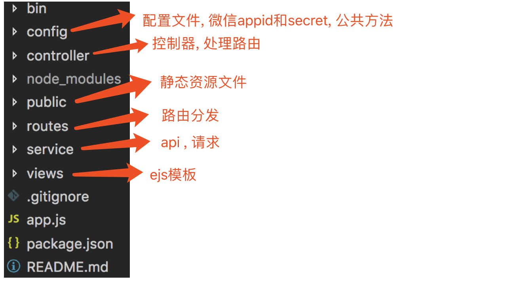

## 玩味 VIP 服务号相关内容

### 代码所在服务器位置

ssh root@47.93.186.198

密码 Z2LXKufw7dfp3Ajw
node 项目所在路径/usr/local/velo/nodejs/nodejs

### forever 开启和关闭服务(由于不是全局安装)

> 开启 node /usr/local/nodejs/node-v8.9.3-linux-x64/bin/forever start /usr/local/velo/nodejs/nodejs/bin/www

> 关闭 node /usr/local/nodejs/node-v8.9.3-linux-x64/bin/forever stop /usr/local/velo/nodejs/nodejs/bin/www

## 1.1  目录说明



## 1.2 velo.top 官网

* app.js 设置 velo.top 官网的静态资源目录

```
app.use(express.static(path.join(__dirname, 'public/company')))
app.use('/', main) // velo.top路由, 由main分发
```

* ./routes/main.js

```
router.get("/", mainControl.index)   // 路由控制器由mainControl.index方法控制
```

* ./controller/mainControl.js 显示官网, 用于工商检查

```
exports.index = (req, res) => {
  // 渲染views/index.ejs模板
  res.render('index')
}
```

## 1.3 玩味 vip 公众号

### 1.3.1 路由

app.js

```
app.use('/nodejs', index);  // velo.top/nodejs路由是主路由, routes/index.js分发
```

### 1.3.2 显示文章列表

* velo.top/nodejs

```
/* 用户点击'分享文章' */
router.get('/', indexControl.main)

// controller/indexControl.js
// 用户点击分享文章, 首先授权, 然后进入文章列表
exports.main = (req, res) => {
  res.render('getAccess', {fromPage: '', ownerUnionid: '', articleId: ''})
}
```

* velo.top/nodejs/articleList

```
router.get('/articleList', indexControl.articleList)
```

### 1.3.3 进入文章详情

```
/* 用户点击文章列表, 进入文章详情 */
router.get('/articleDetail', indexControl.articleDetail)

// controller/indexControl.js
// 用户点击文章列表, 进入文章详情
exports.articleDetail = async (req, res) => {
  let id = req.query.articleId
  let articalContent = await api.getArticalContent(id)
  // req.query.content = articalContent.content.replace(/\\/g, "");
  req.query.vipInFromWeChat = true
  let articalDetail = await api.getArticalById(id)
  req.query.redirectWxArticleUri = articalDetail.redirectWxArticleUri
  res.render('articleDetail', {data: req.query})
}
```

### 1.3.4 分享文章

```
  wx.config({
    debug:false,
    appId:data.appId,
    timestamp:data.timestamp,
    nonceStr:'getoperateaccess',
    signature:data.signature,
    jsApiList: apiList
  })

  wx.ready(function(){

    wx.onMenuShareAppMessage({
      title: '<%= data.articleTitle %>', // 分享标题
      desc: '<%= data.articleDescription %>', // 分享描述
      link: 'http://velo.top/nodejs/fromShareGetAccess?ownerUnionid=<%=data.ownerUnionid%>&articleId=<%= data.articleId %>', // 分享链接，该链接域名或路径必须与当前页面对应的公众号JS安全域名一致
      imgUrl: '<%= data.thumbnailUri %>', // 分享图标
      type: 'link', // 分享类型,music、video或link，不填默认为link
      dataUrl: '', // 如果type是music或video，则要提供数据链接，默认为空
      success: function () {
        // $('.msg').html('分享成功').css('color','red')
      },
      cancel: function () {
        // $('.msg').html('分享失败').css('color','red')
      }
    })

    // 分享到朋友圈
    wx.onMenuShareTimeline({
      title: '<%= data.articleTitle %>', // 分享标题
      desc: '<%= data.articleDescription %>', // 分享描述
      link: 'http://velo.top/nodejs/fromShareGetAccess?ownerUnionid=<%=data.ownerUnionid%>&articleId=<%= data.articleId %>', // 分享链接，该链接域名或路径必须与当前页面对应的公众号JS安全域名一致
      imgUrl: '<%= data.thumbnailUri %>', // 分享图标
      type: 'link', // 分享类型,music、video或link，不填默认为link
      dataUrl: '',
      success: function () {
        // $('.msg').html('分享朋友圈成功').css('color','red')
      },
      cancel: function () {
        // $('.msg').html('分享朋友圈失败').css('color','red')
      }
    })
  })

  wx.error(function(err){
    // $('.configIsOk').html('网页授权验证出错了!!!').css({color:'red'})
  })
```

### 1.3.5 小白点击分享的文章进入文章详情

* routers/index.js

```
/* 用户点击别人分享的文章, 首先进入授权页面 */
router.get('/fromShareGetAccess', indexControl.fromShareGetAccess)

/* 用户点击别人分享的文章, 进入文章详情 */
router.get('/fromShareToDetail', indexControl.fromShareToDetail)
```

* controllers/indexControl.js

```
// 用户点击别人分享的文章, 首先进入授权页面
exports.fromShareGetAccess = async (req, res) => {
  // req.query.ownerUnionid
  // req.query.articleId
  res.render('getAccess', {
    fromPage: 'share',
    ownerUnionid: req.query.ownerUnionid,
    articleId: req.query.articleId
  })
}

// 用户点击别人分享的文章, 进入文章详情
exports.fromShareToDetail = async (req, res) => {
  let ownerUnionid_articleId = req.query.data.split(',')
  let ownerUnionid = ownerUnionid_articleId[0]
  let articleId = ownerUnionid_articleId[1]
  let articalContent = await api.getArticalContent(articleId)
  let info = await api.getUnionid(req, res)
  let articalDetail = await api.getArticalById(articleId)
  // req.query.content = articalContent.content.replace(/\\/g, "")
  req.query.ownerUnionid = ownerUnionid
  req.query.newerUnionid = info.unionid
  req.query.redirectWxArticleUri = articalDetail.redirectWxArticleUri
  // console.log("跳转链接redirectWxArticleUri:", articalDetail.redirectWxArticleUri);
  req.query.articleId = articleId
  // console.log('-----999-----', req.query.redirectWxArticleUri, info, articalDetail)
  res.render('articleDetail', {data: req.query})
}
```

### 1.3.6 授权网页, 文章分享

* controllers/indexControl.js

```
// 授权网页调用微信分享
exports.getWxConfig = async (req, res) => {
  let jsapi_ticket = await api.expose_jsapi_ticket()
  let noncestr = req.query.nonceStr ;
  let timestamp = parseInt(new Date().getTime() / 1000) + '' ;
  let url = req.query.url ;
  let str = `jsapi_ticket=${jsapi_ticket}&noncestr=${noncestr}&timestamp=${timestamp}&url=${url}` ;
  let signature = sha1(str);
  res.json({
    appId:config.wechat.appid,
    signature:signature,
    timestamp:timestamp,
    jsapi_ticket:jsapi_ticket,
    noncestr:noncestr,
    test:123
  })
}
```

### 1.3.7 自定义用户菜单

* controllers/indexControl.js

```
// 设置菜单
exports.setMenu = (req, res) => {
  http.get( 'https://api.weixin.qq.com/cgi-bin/token' , {
    grant_type: 'client_credential',
    appid: config.wechat.appid,
    secret: config.wechat.secret
  }).then((responseToken)=>{
    // console.log('responseToken', responseToken)
    let url = `https://api.weixin.qq.com/cgi-bin/menu/create?access_token=${responseToken.access_token}`
    let menu =  {
      "button":[
      {
       "type":"miniprogram",  //view表示跳转
       "name":"进入商城",
       "url":"pages/index-page",
       "appid":"wx993f6b37a38705db",
       "pagepath":"pages/index-page"
      },
      {
       "type":"view",
       "name":"分享文章",
       "url":"http://velo.top/nodejs"
      }]
    }
    //创建菜单,发送http请求
    axios.post( url ,menu,{
      headers:{
      'content-type':'application/x-www-form-urlencoded'
      }
    }).then(function(dt){
      console.log( '创建菜单请求已发出' , dt.data )
      res.send('创建菜单请求已发出')
    })
  })
  // responseToken.access_token
}
```

## 1.4 响应用户事件

### 1.4.1 接受用户事件

* routers/index.js

```
// 用户的事件, 文字, 点击等事件
router.post('/', eventControl.index)
```

* controllers/eventControl.js

```
// 处理用户事件, 如 发送消息, 主动推送, 发送优惠券
exports.index = (req, res) => {
  let xml = ''
  let json = null
  req.on('data', (chunk) => {
    xml += chunk
  })
  req.on('end', () => {
    xml2js.parseString(xml, {explicitArray: false}, async (err, json) => {
      let backTime = new Date().getTime()
      let userOpenId = json.xml.FromUserName
      console.log('------用户事件-----', json.xml)
      // 消息类型
      if (json.xml.MsgType === 'event' && json.xml.Event === 'unsubscribe') {
        // 用户取消关注事件
        console.log('取消关注公众号的用户的openId', userOpenId)
        res.send('success')

      } else if (json.xml.MsgType === 'event' && json.xml.Event === 'VIEW') {
        // 用户点击菜单事件, 访问网页
        res.send('success')
      }  else if (json.xml.MsgType === 'event' && json.xml.Event === 'subscribe') {
        // 用户关注事件, 将新用户的openId发送到java
        let sendOpenId = await api.sendNewFollowerOpenIdToJava(userOpenId)
        console.log('用户关注事件-发送用户openId到java-结果', sendOpenId)
        res.send('success')

      } else if (json.xml.MsgType === 'text') {
        // 用户发送的文本事件
        if (json.xml.Content === "优惠券") {
          // 用户回复"优惠券", 则将优惠券发给用户
          let checkCoupon = await api.sendOpenIdToJavaCheckVipCoupon(userOpenId)
          if (checkCoupon === 0) {
            let sendCoupon = await api.customerServiceCoupon(userOpenId)
            res.send('success')
          } else {
            sendMsg(json, backTime, res, '您的账户下没有优惠券额O__O')
            res.send('success')
          }

        } else {
          // 用户发送文本消息
          sendMsg(json, backTime, res, "您的反馈我们会认真听取, 谢谢")
        }
      }
    })
  })
}
```

### 1.4.2 响应用户文字消息

* 返回用户的 xml 模板
  config/utils.js

```
exports.getXml = (json, backTime, word) => {
  let backXML = `
                  <xml>
                    <ToUserName><![CDATA[${json.xml.FromUserName}]]></ToUserName>
                    <FromUserName><![CDATA[${json.xml.ToUserName}]]></FromUserName>
                    <CreateTime>${backTime}</CreateTime>
                    <MsgType><![CDATA[text]]></MsgType>
                    <Content><![CDATA[${word}]]></Content>
                  </xml>
                `
  return backXML
}
```

### 1.4.3 提醒用户领取优惠券

* service/api.js

```
// VIP返佣的模板消息给用户提醒
exports.sendTemplateMsg_Rebate = (postBody, url='http://velo.top') => {
  let menberId = Math.ceil(100000000 * Math.random())
  return new Promise((resolve, reject) => {
    http.post(`https://api.weixin.qq.com/cgi-bin/message/template/send?access_token=${accessToken}`, {
      "touser": postBody.vipOpenId,
      "template_id": "3CwSCmnEJxt7YKzhCdwYr8kbcoA8SlClGBHmmxea8RY",
      // "url": url,
      "miniprogram": {
        "appid": "wx993f6b37a38705db",
        "pagepath": "/pages/goods-detail-page?fromPage=minePage"
      },
      "data": {
        "first": {
          "value": `太棒了！您有新奖励(¥${postBody.awardMoney})入账啦~`
        },
        "keyword1": {
          "value": postBody.productTitle
        },
        "keyword2": {
          "value": postBody.orderMoney
        },
        "keyword3": {
          "value": '待到账'
        },
        "remark": {
          "value": ' '
        }
      }
    }).then((dt) => {
      resolve(dt)
    })
  })
}
```

### 1.4.4 用户回复'优惠券'经过判断, 发送优惠券给用户

* service/api.js

```
// 客服回复-发送卡券
exports.customerServiceCoupon = (openId) => {
  let url = `https://api.weixin.qq.com/cgi-bin/message/custom/send?access_token=${accessToken}`
  let data = {
    "touser": openId,
    "msgtype": "wxcard",
    "wxcard": {
      "card_id": 'poxWa06b2iynxY3TkTS8o6eoo2g4'
    }
  }
  return new Promise((resolve, reject) => {
    http.post(url, data).then((dt) => {
      console.log('客服回复消息', dt)
      resolve(dt)
    })
  })
}
```
